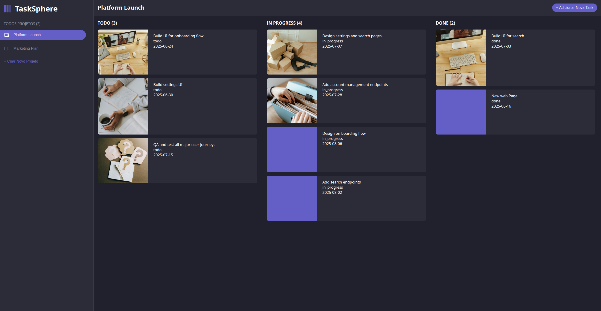

# 📋 TaskSphere

**TaskSphere** é uma aplicação web de gerenciamento de tarefas com suporte a projetos, arrastar-e-soltar entre colunas, e interface responsiva. O objetivo é facilitar a organização visual de tarefas em um modelo de kanban moderno.

---



---

## 🚀 Funcionalidades

- ✅ Criação e gerenciamento de projetos
- ✅ Adição de tarefas com título, status, imagem e data limite
- ✅ Drag & Drop entre colunas: **Todo**, **In Progress**, **Done**
- ✅ Interface responsiva com Atomic Design
- ✅ Integração com API fake via `json-server` hospedado no Render

---

## 🛠️ Tecnologias Utilizadas

- [React](https://react.dev/) + [Vite](https://vitejs.dev/)
- [DnD Kit](https://dndkit.com/) – drag-and-drop moderno e acessível
- [json-server](https://github.com/typicode/json-server) – API fake REST
- [React Select](https://react-select.com/)
- [React Modal](https://reactcommunity.org/react-modal/)
- CSS Flexbox + media queries

---

## 🌐 Deploy

### 🔸 Frontend (Netlify)
📍 https://tasks-phere.netlify.app/ 

### 🔸 Backend (json-server via Render)
📍 https://tasksphere-api-4pmn.onrender.com

---

## 📦 Requisitos

- Node.js >= 16
- npm ou yarn

---

## ▶️ Como rodar localmente
```
# Clone o repositório
git clone https://github.com/Jonas-petty/TaskSphere.git
cd TaskSphere/front-end

# Instale as dependências
npm install

# Inicie o app em modo de desenvolvimento
npm run dev
```

## 📂 Estrutura do Projeto (resumida)

```
src/
├── assets/
├── atoms/
├── molecules/
├── organisms/
├── pages/
├── routes/
├── services/
├── utils/
├── App.jsx
├── main.jsx
public/
db.json
```

## 📌 Futuros Planos

- Back-end real com NodeJs ou Spring Boot;
- Autenticação mais robusta;
- Tela de conteúdo das Tasks;
- Tela de conteúdo dos Projects;
- Bug fixes;

## ✍️ Autor
Desenvolvido por Jonas Felix 🚀
Se curtir, ⭐ o repositório e contribua com sugestões ou issues!

## 📄 Licença
Este projeto está sob a licença MIT.